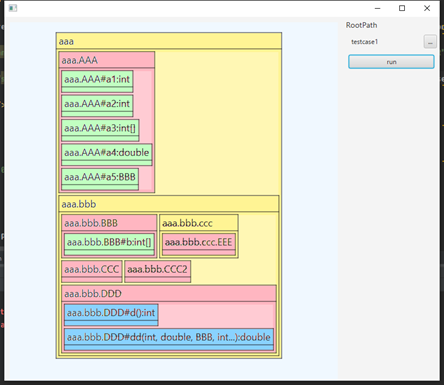
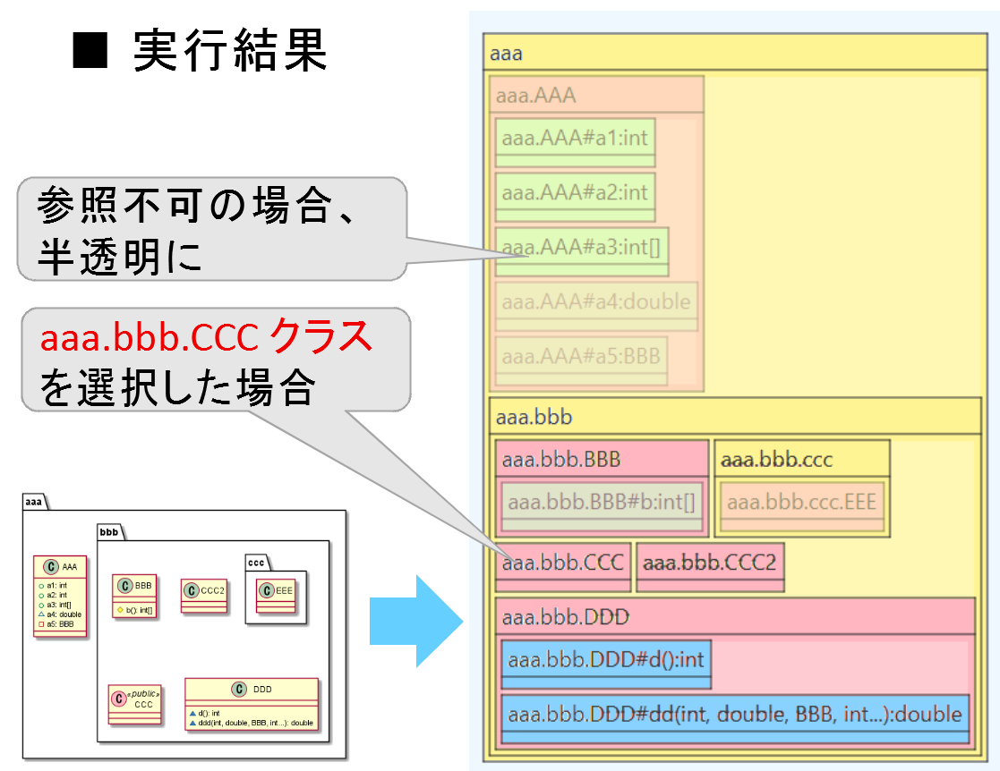
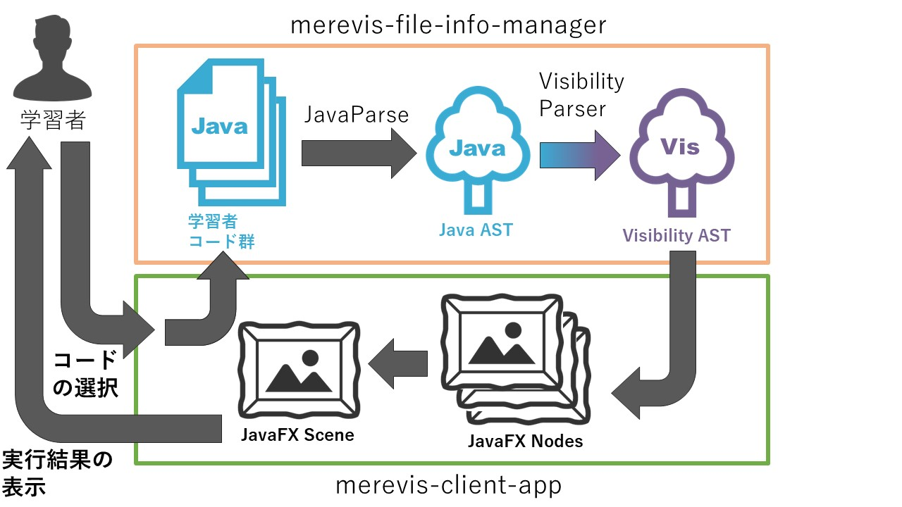

## Javaにおける可視性に基づく参照可不可の可視化ツール **merevis**
本ツールは，Javaのソースコード群のディレクトリ構造・各メンバの参照可能性を可視化するツールです．
任意のプログラムのディレクトリ構造，クラス・メンバを図示し，各要素の参照可能性を色で表現しています．また，選択した要素から参照できない要素は半透明で表示されます．

## 使い方
1. RootPathにJavaプロジェクトのルートディレクトリを指定
2. runボタンをクリック
3. 表示された画像上の注目したい要素をクリック

## 参考画像

